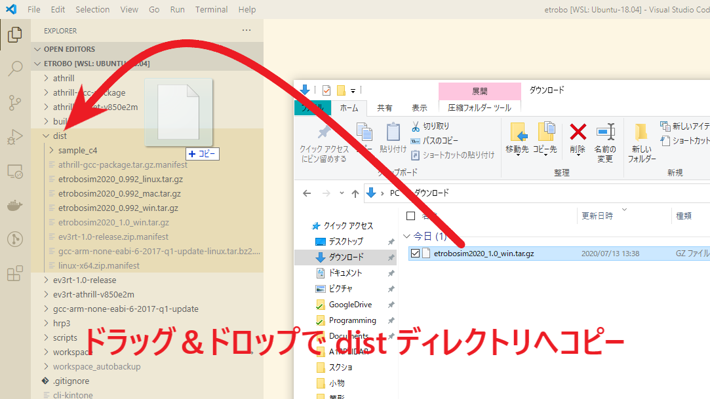
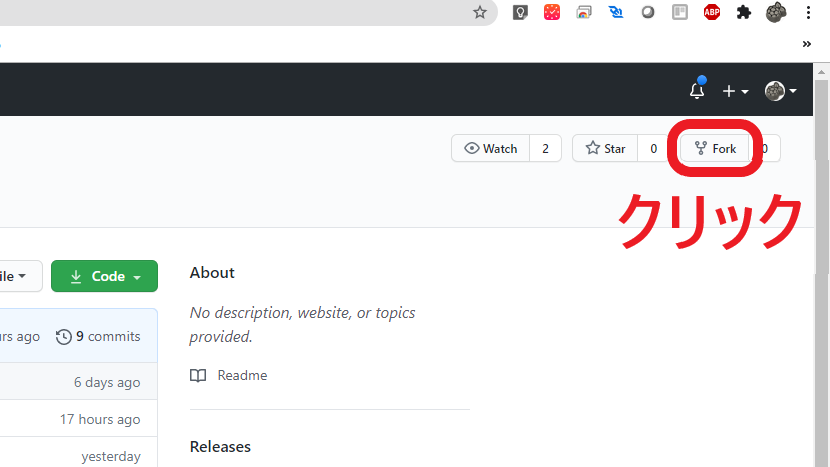
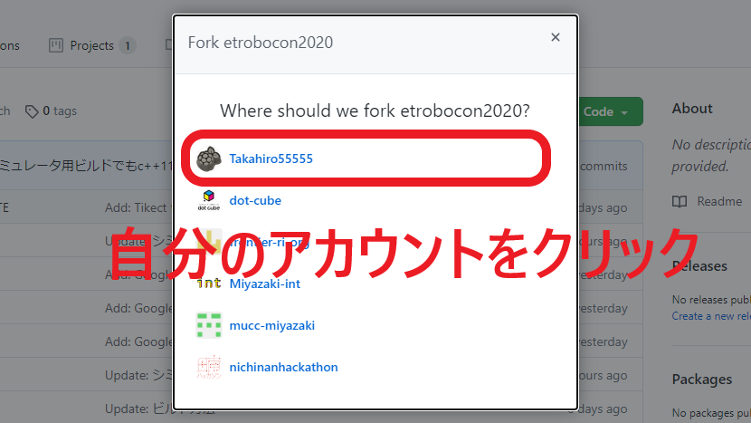
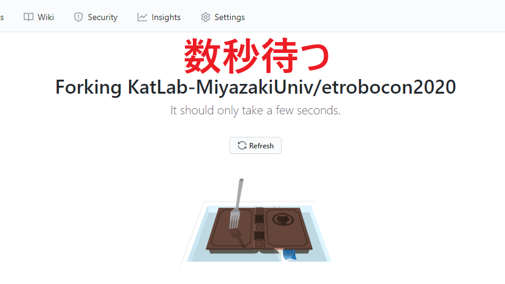
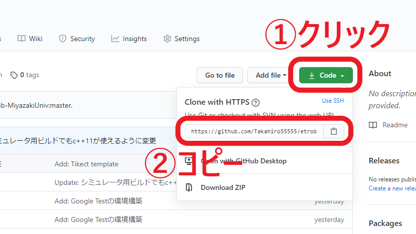

# etrobocon2020


## 環境構築

### 前提条件

- Windows の場合は、WSL1 の Ubuntu18.04 をインストール済み
- [etrobo パッケージ](https://github.com/ETrobocon/etrobo)をインストール済み
- `etrobo シミュレータ v1.0`をダウンロードしている

### 手順

#### 1. etrobo シミュレータ v1.0 にアップデートする

すでに `etrobo シミュレータ v1.0` にアップデートしている人は、飛ばしてください。

##### 1.1 開発環境（etrobo パッケージ）を起動し、VSCode を開く

##### 1.2 ダウンロードした`etrobo シミュレータ v1.0`のファイル（例：`etrobosim2020_1.0_win.tar.gz`）があるディレクトリを開く

##### 1.3 `etrobo シミュレータ v1.0`のファイルを`dist`ディレクトリにコピーする

   <details><summary>【画像】詳しい手順を見るにはここをクリック！！！</summary><div>
   
   
   
   </div></details>
   
   ##### 1.4 アップデート

念のため、開発環境のアップデートを行います

```
$ cd ~/etrobo
$ update
```

#### 2. リポジトリを`Fork`する

   <details><summary>【画像】詳しい手順を見るにはここをクリック！！！</summary><div>









   </div></details>

#### 3. etrobo/workspace/ に `Fork`先の etrobocon2020 を配置する

```
$ cd ~/etrobo/workspace
$ git clone https://github.com/[自分のGitHubユーザ名]/etrobocon2020.git
```

※）`https://github.com/[自分のGitHubユーザ名]/etrobocon2020.git`の部分は先ほどコピーした URL を使う。

#### 4. KatLab のリポジトリを `upstream` として登録する

最新状態である KatLab のリポジトリから、更新内容を取得する(git pull)ために行う

```
$ cd ~/etrobo/workspace/etrobocon2020
$ git remote add upstream https://github.com/KatLab-MiyazakiUniv/etrobocon2020.git
```

## ビルド方法

### L コースの場合

etrobo ディレクトリで以下のコマンドを実行する  
 `make app=etrobocon2020 sim up`

etrobocon2020 ディレクトリでビルドをしたい場合は、上記コマンドの`make`を`./make.sh`に置き換えて実行する  
`./make.sh app=etrobocon2020 sim up`

### R コースの場合

etrobo ディレクトリで以下のコマンドを実行する  
 `make right app=etrobocon2020 sim up`

etrobocon2020 ディレクトリでビルドをしたい場合は、上記コマンドの`make`を`./make.sh`に置き換えて実行する  
`./make.sh right app=etrobocon2020 sim up`

## Google Test の実行方法

`~/etrobo/workspace/etrobocon2020`にある`gtest_all.sh`ファイルを実行することで、 Google Test を実行できます。

```
$ cd ~/etrobo/workspace/etrobocon2020
$ ./gtest_all.sh
```

#### **!!** エラーが発生した場合

- `cmake`をインストールしていない場合

  以下のようなエラーが発生した際は、`cmake`をインストールしなければいけません。

  ```
  ./test/gtest/gtest_build.sh: 9: ./test/gtest/gtest_build.sh: cmake: not found
  ```

  Windows の場合は、 `sudo apt install cmake`を実行して`cmake`をインストールした後、もう一度`gtest_all.sh`ファイルを実行してください。

  macOS の場合は、[Homebrew](https://brew.sh/index_ja)をインストールし、`brew install cmake`を実行して`cmake`をインストールした後、もう一度`gtest_all.sh`ファイルを実行してください。

TODO: 後で整備する
